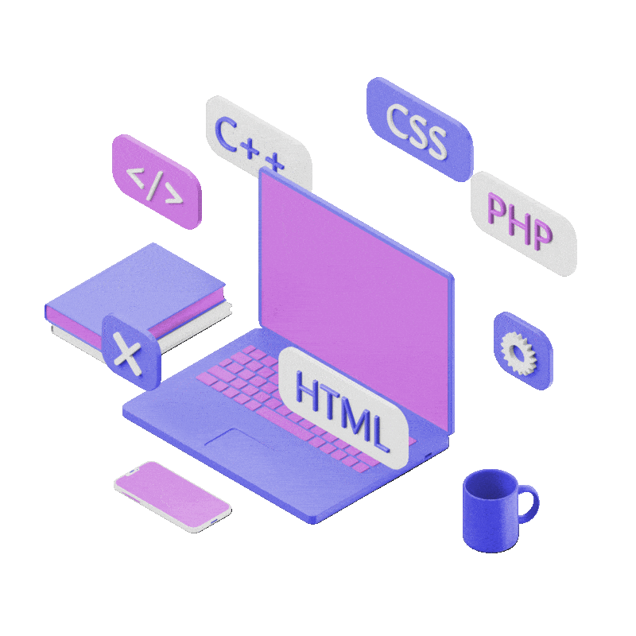

<div align="center">

# Hi there, I'm Rishoni De Silva 

### Full-stack engineer building and scaling enterprise-grade products — from performance optimization to reliable, on-time delivery.


[](https://github.com/RishoniDeSilva)

</div>

---

## 🧬 `whoami`

```typescript
const rishoni = {
  role: "Software Engineer",
  code: ["TypeScript", "JavaScript", "Python", "Java", "PHP"],
  frontend: ["React", "Next.js", "HTML5", "CSS"],
  backend: ["Node.js", "Laravel"],
  cloudAndOps: ["Docker", "Kubernetes", "GCP", "CircleCI"],
  focus: ["Scalability", "Performance optimization", "Enterprise delivery"],
  motto: "Build it right, then scale it further. 🚀",
};
```



## 🚀 What I do

- 🏗️ **Scalable systems** — contributing to and scaling up enterprise-grade projects
- ⚡ **Performance optimization** — profiling, tuning, and squeezing latency out of frontend & backend alike
- 🎨 **Frontend** — building fast, accessible UIs with **React** & **Next.js**
- ⚙️ **Backend** — designing robust APIs and services with **Node.js** & **Laravel**
- ☁️ **Cloud & CI/CD** — shipping reliably with **Docker**, **Kubernetes**, **GCP** & **CircleCI**
- 🧪 **Quality & delivery** — test automation and disciplined releases, delivering projects end-to-end

<br clear="right"/>

---

## 🛠️ Tech Stack

<div align="center">

**Languages**


**Frontend**


**Backend**


**Cloud & DevOps**


</div>

---

## 📊 GitHub Stats

<div align="center">
  
  
</div>

---

## ⚡ A day in my terminal

<table>
<tr>
<td width="55%">

```bash
$ git commit -m "fix: it works now"
$ git commit -m "fix: it actually works now"
$ git commit -m "fix: final fix"
$ git commit -m "fix: final fix (for real)"
$ git push --force-with-lease
✨ shipped
```

</td>
<td align="center">


</td>
</tr>
</table>

---

<div align="center">

## 🤝 Let's Connect

[](https://github.com/RishoniDeSilva)
[](https://www.linkedin.com/in/rishoni-de-silva)


*There's no place like `127.0.0.1`* 🏠


</div>
